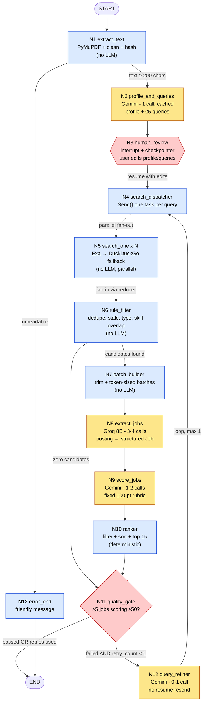
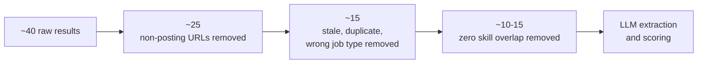
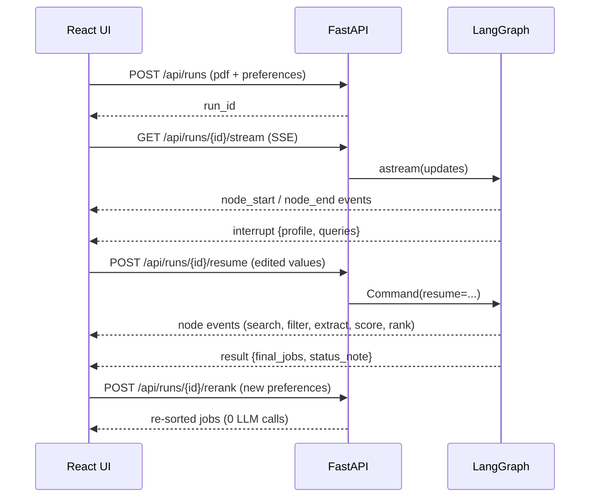

# Resume → Job Matcher

> A LangGraph-powered agent that reads your PDF resume, builds a structured profile, searches the web for matching jobs, scores each one against you, and ranks the results the way you want, all running on **free-tier** Gemini, Groq, and Exa quotas.


---

## Table of Contents

1. [What it does](#1-what-it-does)
2. [Key features](#2-key-features)
3. [Architecture and graph](#3-architecture-and-graph)
4. [Node reference](#4-node-reference)
5. [State and schemas](#5-state-and-schemas)
6. [Token and rate-limit strategy](#6-token-and-rate-limit-strategy)
7. [Tech stack](#7-tech-stack)
8. [Project structure](#8-project-structure)
9. [Getting started](#9-getting-started)
10. [Configuration](#10-configuration)
11. [Using the app](#11-using-the-app)
12. [API reference](#12-api-reference)
13. [Development modes and testing](#13-development-modes-and-testing)
14. [Privacy and responsible use](#14-privacy-and-responsible-use)
15. [Troubleshooting](#15-troubleshooting)
16. [Contributing and license](#16-contributing-and-license)

---

## 1. What it does

1. You upload a PDF resume and set preferences (job type, minimum salary, location, sort priority).
2. An LLM converts the resume into a **compact structured profile** and generates **targeted search queries**.
3. You review and edit the profile and queries (human-in-the-loop).
4. Queries run **in parallel** on Exa (primary) and DuckDuckGo (fallback).
5. Rule-based filters cut the results from about 40 down to about 15 candidate postings **before** any LLM sees them.
6. Groq extracts structured fields from each posting; Gemini scores each job against your profile with a fixed rubric.
7. A deterministic ranker sorts the results by your preference (match, salary, or recency).
8. A quality gate decides whether the results are good enough, or runs **one** refined search retry.
9. The React UI streams progress live and shows ranked job cards.

**Design principle:** the LLM is used only where language understanding is required. Everything else (dedupe, filtering, salary normalization, sorting, batching) is plain Python.

---

## 2. Key features

| Feature | Detail |
|---|---|
| **LangGraph-native** | Shared state, conditional edges, `Send` fan-out, bounded loop, `interrupt` with SQLite checkpointer |
| **Free-tier friendly** | At most **6-8 LLM calls per run**, aggressive pre-filtering, caching |
| **Two LLMs, right job each** | Gemini for few large-context calls; Groq 8B for many small extraction calls |
| **Human-in-the-loop** | Edit skills, titles, and queries before searching |
| **Deterministic ranking** | Sorting is code, not an LLM opinion; changing preferences costs **0 tokens** |
| **Resilient** | Retry with backoff on 429, provider fallback, graceful degradation to keyword ranking |
| **Live progress** | Server-Sent Events stream each node's status to the UI |
| **Mock mode** | Build and demo the whole app with zero API usage |

---

## 3. Architecture and graph

### 3.1 Full LangGraph flow



**Legend:** yellow = LLM node, blue = pure Python node, red = decision / interrupt point.

### 3.2 Candidate funnel (why the LLM budget stays small)



### 3.3 Human-in-the-loop and streaming sequence



---

## 4. Node reference

| # | Node | Type | Model | Purpose | LLM calls |
|---|---|---|---|---|---|
| N1 | `extract_text` | Python | none | PDF to clean text, cap at 6000 chars, compute `resume_hash`, check cache | 0 |
| N2 | `profile_and_queries` | LLM | Gemini Flash | Build profile and up to 5 search queries in a single call | 1 (cached) |
| N3 | `human_review` | Interrupt | none | Pause so the user can edit profile and queries | 0 |
| N4 | `search_dispatcher` | Python | none | Fan out one `Send` per query | 0 |
| N5 | `search_one` | Python | none | Exa search with date and domain filters; DuckDuckGo fallback | 0 |
| N6 | `rule_filter` | Python | none | Dedupe, drop non-postings, stale, wrong type; compute skill-overlap `rule_score`; keep top 15 | 0 |
| N7 | `batch_builder` | Python | none | Trim each posting (~900 tokens) and pack into token-sized batches | 0 |
| N8 | `extract_jobs` | LLM | Groq `llama-3.1-8b-instant` | Posting text to structured `Job` fields | 3-4 |
| N9 | `score_jobs` | LLM | Gemini Flash | Score 0-100 with fixed rubric, reason, matched and missing skills | 1-2 |
| N10 | `ranker` | Python | none | Hard filters, deterministic sort, top 15 | 0 |
| N11 | `quality_gate` | Router | none | Pass, retry, or end with a note | 0 |
| N12 | `query_refiner` | LLM | Gemini Flash | Diagnose failure, write up to 4 new queries (no resume) | 0-1 |
| N13 | `error_end` | Python | none | Friendly failure message | 0 |

### Scoring rubric (N9)

| Component | Points |
|---|---|
| Skill overlap (matched required / total required) | 40 |
| Seniority and experience fit (penalizes over- and under-qualified) | 25 |
| Domain and title relevance | 20 |
| Preference fit (job type, location) | 15 |

### Conditional edges

- **After N1:** `len(resume_text) >= 200` continues, otherwise `error_end`.
- **After N6:** zero candidates skips extraction and scoring, going straight to `quality_gate`.
- **After N11:** `gate_passed` or `retry_count >= MAX_RETRIES` ends; otherwise `query_refiner`.

---

## 5. State and schemas

### Graph state

| Field | Purpose |
|---|---|
| `run_id`, `pdf_bytes`, `preferences` | Inputs |
| `resume_text`, `resume_hash` | Cleaned text and cache key |
| `profile`, `queries` | LLM-built profile and search queries |
| `raw_results` | Reducer-backed append list, safe for parallel writes |
| `seen_urls` | Dedupe across the retry loop |
| `candidates`, `batches` | After rule filter, and token-sized groups |
| `jobs`, `scored_jobs`, `final_jobs` | Structured, scored, and ranked output |
| `retry_count`, `gate_passed`, `status_note` | Loop and UI control |
| `errors` | Reducer-backed non-fatal failures |

### Core Pydantic models

| Model | Key fields |
|---|---|
| `Preferences` | `job_types`, `min_salary_inr_annual`, `locations`, `sort_by` (`match` / `salary` / `recency`), `max_age_days` |
| `Profile` | `seniority`, `years_experience`, `top_skills` (≤12), `domains` (≤5), `past_titles` (≤4), `education`, `location`, `target_titles` (≤3) |
| `SearchQuery` | `q` (≤12 words), `angle` (`exact_title` / `adjacent_title` / `skill_stack` / `site_targeted`), `site` |
| `RawResult` | `url`, `title`, `text`, `published`, `source_query`, `rule_score` |
| `Job` | `idx`, `is_real_posting`, `title`, `company`, `location`, `remote`, `job_type`, salary min/max/currency/period, `skills_required` (≤10), `experience_years_min`, `posted_date` |
| `Score` | `idx`, `score` (0-100), `reason` (≤20 words), `matched_skills` (≤5), `missing_skills` (≤3) |
| `RefinerOutput` | `diagnosis` (one sentence), `queries` (≤4) |
| `ScoredJob` | `Job` + `Score` + `url` + `salary_annual_inr` (computed in Python) + `rule_score` |

Full definitions live in `backend/schemas.py`.

---

## 6. Token and rate-limit strategy

Free tiers are the main constraint, so the design treats tokens as a budget.

| Control | Value |
|---|---|
| LLM calls per run | **≤ 8** (1 profile + 3-4 extract + 1-2 score + ≤1 refine) |
| Resume sent to LLM | Once, capped at 6000 chars |
| Per-posting trim | ~900 tokens for extraction, ~200 chars for scoring |
| Output caps | profile+queries ~900 tok, extract ~120 tok/job, score ~60 tok/job |
| Output style | Structured JSON only, reasons ≤20 words, gaps ≤3 |
| Temperature | 0 |
| Execution | LLM calls **sequential** with ~2 s delay; only search and scrape run in parallel |
| Retries | Exponential backoff on 429, then fallback provider, then partial result |
| Retry loop | Max 1 refiner pass, no resume resend, only new URLs |
| Preference changes | Re-run ranker only: **0 LLM calls** |

**Caching (SQLite):** `resume_hash → profile + queries`, `url_hash → Job`, `(resume_hash, url_hash) → Score`. The cache is always checked before any LLM call.

**Provider routing:** Gemini is request-limited, so it gets few, large calls. Groq is token-limited, so it gets many small extraction calls on the 8B model. Each LLM node falls back to the other provider on exhaustion.

**Graceful degradation:** if both providers are exhausted, the app does not crash. It ranks unscored jobs by keyword `rule_score` and shows the banner *"AI scoring unavailable, showing keyword-based matches."*

> Free-tier limits change often. Check the current numbers in Google AI Studio and the Groq console, then tune the values in `config.py`.

---

## 7. Tech stack

| Layer | Technology |
|---|---|
| Orchestration | LangGraph, LangChain core |
| LLMs | Google Gemini Flash, Groq (Llama 3.1 8B Instant) |
| Search | Exa (primary), DuckDuckGo (fallback) |
| PDF | PyMuPDF (optional OCR: pytesseract + pdf2image) |
| Scraping fallback | httpx, trafilatura |
| Backend | FastAPI, Uvicorn, sse-starlette |
| Persistence | SQLite (checkpointer and cache) |
| Frontend | React, Vite, Tailwind CSS, framer-motion, react-dropzone, `@microsoft/fetch-event-source`, lucide-react |

---

## 8. Project structure

```
resume-job-matcher/
├── backend/
│   ├── config.py          # all tunable limits (CONFIG values)
│   ├── state.py           # GraphState + reducers
│   ├── schemas.py         # Pydantic models
│   ├── graph.py           # graph assembly, edges, checkpointer
│   ├── llm.py             # provider wrapper, rate limiter, retries, fallbacks
│   ├── cache.py           # SQLite cache tables
│   ├── search.py          # Exa + DuckDuckGo + scrape fallback
│   ├── api.py             # FastAPI routes + SSE
│   ├── nodes/
│   │   ├── extract_text.py
│   │   ├── profile_and_queries.py
│   │   ├── human_review.py
│   │   ├── search.py
│   │   ├── rule_filter.py
│   │   ├── batch_builder.py
│   │   ├── extract_jobs.py
│   │   ├── score_jobs.py
│   │   ├── ranker.py
│   │   ├── quality_gate.py
│   │   └── query_refiner.py
│   └── tests/             # rule_filter, ranker, salary normalizer, batch_builder
├── fixtures/              # sample resume text + saved job pages for mock mode
├── frontend/              # React + Vite app
├── .env.example
└── README.md
```

---

## 9. Getting started

### Prerequisites

- Python 3.11+
- Node.js 18+

> [!IMPORTANT]
> **You must obtain your own API keys.**
> Do **not** commit your `.env` file or expose your API keys. The `.env` file is already listed in `.gitignore` to prevent secret leaks. All required providers offer generous **free tiers**:
> 
> 1. **Google Gemini Flash (`GOOGLE_API_KEY`)**: Get a free API key at [Google AI Studio](https://aistudio.google.com/).
> 2. **Groq Llama 3.1 8B (`GROQ_API_KEY`)**: Get a free API key at [Groq Console](https://console.groq.com/).
> 3. **Exa Search (`EXA_API_KEY`)**: Sign up and generate a key at [Exa AI](https://exa.ai/) (includes free search credits).
> 4. **DuckDuckGo**: Needs **no key** (used automatically as fallback).
> 5. **LangSmith (`LANGSMITH_API_KEY`)**: *(Optional)* for execution tracing at [smith.langchain.com](https://smith.langchain.com/).

### Backend Setup

```bash
git clone <your-repo-url> resume-job-matcher
cd resume-job-matcher/backend

# Create and activate virtual environment
python -m venv .venv
source .venv/bin/activate          # Windows: .venv\Scripts\activate

# Install dependencies
pip install -r requirements.txt

# Copy environment template and add your own API keys
cp ../.env.example ../.env         # Windows: copy ..\.env.example ..\.env
```

Open `.env` in your editor and enter your keys:
```env
GOOGLE_API_KEY=your_gemini_api_key_here
GROQ_API_KEY=your_groq_api_key_here
EXA_API_KEY=your_exa_api_key_here
MOCK_LLM=false                     # set to false for live API calls, true for zero-token mock testing
```

Start the backend server:
```bash
uvicorn api:app --reload --port 8000
```

### Frontend Setup

In a new terminal:
```bash
cd frontend
npm install
npm run dev                        # opens http://localhost:5173
```

### Try it without spending any quota (Mock Mode)

If you haven't received your API keys yet or want to test offline:
```bash
# in .env
MOCK_LLM=true
```

The full graph, streaming, and UI will run with zero external API calls using canned fixtures.

---

## 10. Configuration

### Environment variables (`.env`)

| Variable | Required | Description | Where to Get |
|---|---|---|---|
| `GOOGLE_API_KEY` | Yes (for live mode) | Gemini 1.5 Flash key | [Google AI Studio](https://aistudio.google.com/) |
| `GROQ_API_KEY` | Yes (for live mode) | Groq Llama 3.1 8B key | [Groq Console](https://console.groq.com/) |
| `EXA_API_KEY` | Yes (for live mode) | Exa web search key | [Exa.ai](https://exa.ai/) |
| `LANGSMITH_API_KEY` | No | Optional LangGraph tracing | [LangSmith](https://smith.langchain.com/) |
| `MOCK_LLM` | No | `true` runs on fixtures, `false` makes live calls | Local toggle |

### Tunable limits (`backend/config.py`)

| Setting | Default | Meaning |
|---|---|---|
| `MAX_QUERIES` | 5 | Search queries per run |
| `MAX_RETRIES` | 1 | Refiner loop cap |
| `RESUME_CHAR_CAP` | 6000 | Resume characters sent to the LLM |
| `EXA_NUM_RESULTS` | 8 | Results per query |
| `MAX_CANDIDATES` | 15 | Postings kept after rule filter |
| `JOB_TOKEN_CAP` | ~900 | Tokens per posting for extraction |
| `GROQ_BATCH_TOKEN_BUDGET` | ~3000 | Input tokens per extraction batch |
| `MAX_TO_SCORE` | 15 | Jobs sent to Gemini scoring |
| `GOOD_JOBS_MIN` | 5 | Strong matches (score ≥ 50) needed to pass the gate |
| `LLM_DELAY_SECONDS` | 2 | Pause between LLM calls |
| `FX_USD_INR` | set manually | Currency conversion for salary normalization |

**If you hit quota walls, turn these first:** `MAX_CANDIDATES`, `MAX_TO_SCORE`, `MAX_QUERIES`.

---

## 11. Using the app

1. **Upload and set preferences.** Drop your PDF, pick job types (intern, full-time, contract, part-time), set a salary slider (LPA), enter locations (with a remote toggle), and choose a sort order.
2. **Watch progress.** A live stepper shows each node and counts, such as "Found 23 results".
3. **Review the profile.** Edit skill chips, target titles, and queries, then click **Looks good, search**.
4. **Explore results.** Each card shows a match-score ring, matched (green) and missing (amber) skills, a salary badge ("Not listed" when absent), job type, posting age, and an Apply button.
5. **Re-sort instantly.** Changing sort or filters calls `/rerank` and costs **zero** LLM tokens. Only a changed target role regenerates queries.

Status banners appear when results are partial (for example, fewer than 5 strong matches, or AI scoring unavailable).

---

## 12. API reference

| Method | Endpoint | Description |
|---|---|---|
| `POST` | `/api/runs` | Multipart: `pdf` + `preferences` JSON. Starts the graph, returns `{run_id}` |
| `GET` | `/api/runs/{id}/stream` | SSE stream of run events |
| `POST` | `/api/runs/{id}/resume` | Body `{profile, queries}`. Continues from the interrupt |
| `POST` | `/api/runs/{id}/rerank` | Body `{preferences}`. Re-runs the ranker on cached scores |

### SSE events

| Event | Payload |
|---|---|
| `node_start` | `{node}` |
| `node_end` | `{node, summary}` |
| `interrupt` | `{profile, queries}` |
| `result` | `{final_jobs, status_note}` |
| `error` | `{message}` |

Progress is produced with `astream(stream_mode="updates")`.

---

## 13. Development modes and testing

Build in this order to protect your quota:

1. **Mock mode** (`MOCK_LLM=true`): build the graph, SSE, and UI at zero cost.
2. **Fixtures:** one resume text and about 20 saved job pages. Develop N6-N10 offline.
3. **Enable LLM nodes one at a time:** N2, then N8, then N9, then N12, testing each in isolation.
4. **Enable live search** with a small dev set (3 queries, 8 candidates).
5. **Add the interrupt and checkpointer**, then retry, backoff, and fallbacks.

### Tests

```bash
cd backend
pytest tests/
```

Deterministic nodes are covered: `rule_filter`, `ranker`, the salary normalizer, and `batch_builder`.

---

## 14. Privacy and responsible use

- **Intended for local, personal use.** There is no authentication, multi-user handling, or deployment hardening.
- **Resume privacy:** on free API tiers, providers may use prompts to improve their products. Strip your name, phone number, and email with a regex in `extract_text` before the LLM call. Job matching does not need them.
- **Scraping:** keep the built-in delays and request volume modest. Login-walled sites (such as LinkedIn) are not scraped; the project favors open boards and company career pages.
- **Untrusted content:** scraped pages are treated as data. Every prompt that sees them instructs the model to ignore embedded instructions.
- **No fabrication:** unknown fields stay `null`. Salaries are never guessed.

---

## 15. Troubleshooting

| Symptom | Likely cause and fix |
|---|---|
| `429` errors | Free-tier limit hit. Backoff and fallback should handle it; lower `MAX_CANDIDATES` and `MAX_TO_SCORE`, or increase `LLM_DELAY_SECONDS` |
| "Could not read resume" | Scanned PDF. Install Tesseract and Poppler to enable the OCR fallback |
| Few or zero results | Broaden locations or job type; check `errors` in state; the refiner will retry once |
| Many "Not listed" salaries | Normal, since many postings omit pay. They are kept and ranked last in salary sort |
| Empty results from a site | Likely login-walled or blocking scrapers. Use other boards |
| Interrupt never resumes | Confirm the same `thread_id` (`run_id`) and that the SQLite checkpointer is initialized |
| Everything works but is slow | LLM calls are intentionally sequential with delays to respect rate limits |

---

## 16. Contributing and license

Contributions are welcome. Keep changes within the LLM call budget (**≤ 8 per run**) and keep deterministic logic out of the LLM. Open an issue before proposing anything that increases token usage.

Released under the MIT License. See `LICENSE`.
